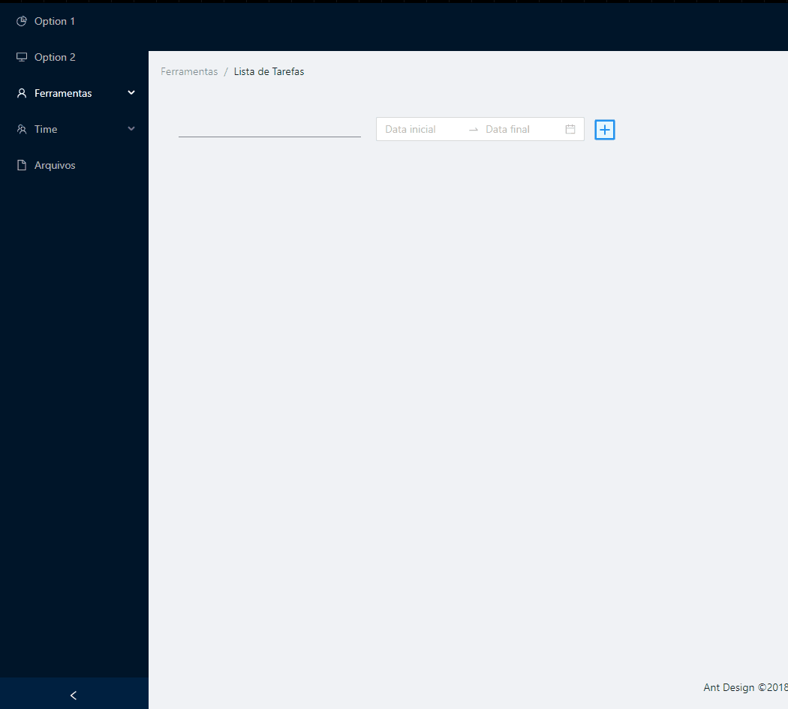

# todolist-react

### Simples To do List para desktop:
* React.js
* Typescript
* Bibliote escolhida: [AntDesign](https://ant.design/)

### AntDesign
Layouts completos e componentes individuais prontos (icones, botões, inputs, calendários, gráficos, menus...).

### DEPLOY da primeira versão: Vercel -> https://todolist-igti.vercel.app/

### Gif da versão final:

### Trabalho desenvolvido para o MBA [IGTI](https://www.igti.com.br/)
